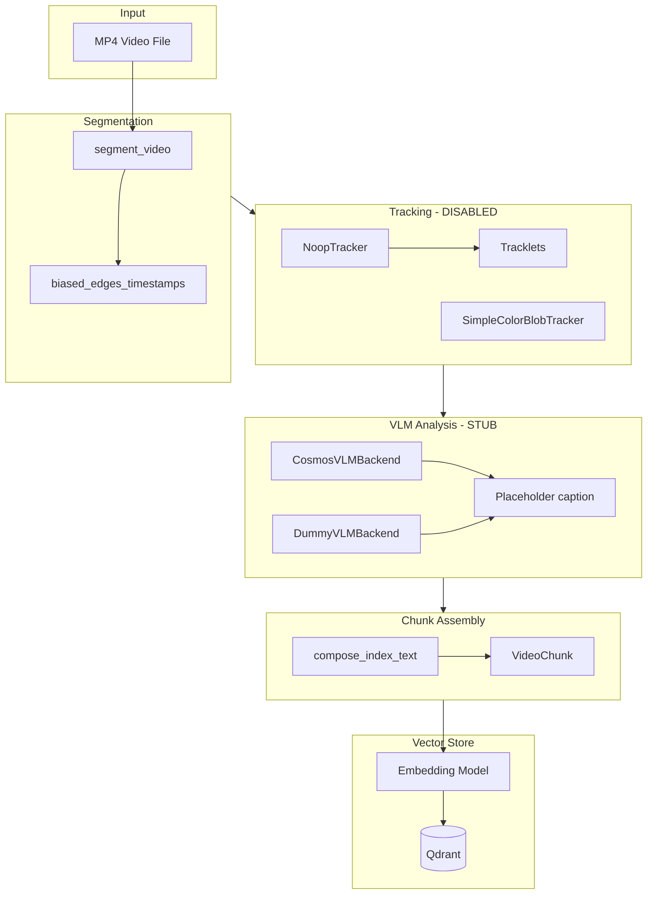

# Video Ingestion Pipeline — Technical Overview

This document explains how video ingestion works, what is generated and stored for each video chunk, and what capabilities exist (or are stubbed) for OCR and object tracking.

---

## 1. Pipeline Flow

---

## 2. Step-by-Step Process

### 2.1 Segmentation (`worker/worker/video/video_processor.py`)

- **Fixed-window segments:** Video is split into segments of `segment_sec` (default 4s) with `overlap_sec` (default 1s).
- **Frame sampling:** Each segment samples `num_frames` (default 10) timestamps using a **biased-edges** strategy:
  - 2 frames near the start (10%, 20% into segment)
  - Frames spread in the middle
  - 2 frames near the end (80%, 90%)
- **Output:** A `Segment` holds `t_start`, `t_end`, `frame_times`, and `frames` (BGR numpy arrays; `None` on read failure).

### 2.2 CV Pipeline (Optional — Object Tracking)

- **Control flow:** When `enable_cv=True`, the CV (tracker) pipeline runs. With `cv_before_vlm=True`, CV runs on all segments first, then VLM (optionally `cv_parallel=True` for parallel CV across segments).
- **Tracker:** `NoopTracker` by default; `YOLOTracker` (local) or `YOLOAPITracker` (Roboflow) when `object_tracker=yolo` or `yolo_api`; `SimpleColorBlobTracker` when `object_tracker=simple_blob`. When `YOLO_API_URL` and `YOLO_API_KEY` are set, `yolo` uses the API; `yolo_api` always uses the API.
- **Schema for tracks:** Each `Tracklet` has `track_id`, `label`, `bboxes` (t, x, y, w, h per frame).
- **cv_meta:** Serialized JSON of tracks (bounding boxes, class labels, tracking IDs) is stored in `VideoChunk.cv_meta` and persisted to Qdrant payload when present.

### 2.3 VLM Analysis

- **Backends:** DummyVLMBackend (no API), OpenAICompatibleVLMBackend (GPT-4V, LLaVA, cosmos-reason2).
- **cosmos-reason2:** When `model_id` contains "cosmos-reason2", the prompt appends "Make sure the answer contain correct timestamps."
- **Think block parsing:** For models that output think blocks (e.g. cosmos-reason2), the reasoning is extracted for UI/debug; only the caption text after the block is used for embedding.

### 2.4 Index Text Composition

- **Function:** `compose_index_text(caption, events, entities, transcript_slice)` in [schemas.py](worker/worker/video/schemas.py).
- **Behavior:** Concatenates caption + JSON-serialized events + JSON-serialized entities. `transcript_slice` is a stub (not implemented).
- **Result:** `index_text` is the text used for embedding and RAG retrieval.

### 2.5 Embedding and Storage

- **Embedding:** The `index_text` of each chunk is truncated (e.g. 512 tokens) and sent to the embedding model.
- **Stored in Qdrant:**
  - **Vector:** Embedding of `index_text`.
  - **Payload:**
    - `text`: the `index_text` (used for retrieval/display; RAG uses `payload.text` or `payload.content`).
    - `source_file`: original filename.
    - `video_id`: e.g. `job_{job_id}_{stem}`.
    - `t_start`, `t_end`, `start_pts`, `end_pts`: segment time range in seconds.
    - `uuid`: stream/file identifier (same as `video_id`).
    - `frame_times`: sampled timestamps.
    - `fields`: full VLM output (caption, events, entities, notes, reasoning, etc.).
    - `cv_meta`: serialized CV JSON (when tracking enabled).
    - `hash`: cache key for the chunk.

---

## 3. What Is Actually Stored in the Vector Store

| Field        | Source            | Description                                              |
|--------------|-------------------|----------------------------------------------------------|
| **Vector**   | Embedding of text | Embedding of the VLM description (`index_text`)          |
| `text`       | `index_text`      | Text used for embedding (caption + events + entities)    |
| `source_file`| original_filename | e.g. "demo.mp4"                                         |
| `video_id`   | job + stem        | e.g. "job_video_abc123_demo"                             |
| `t_start`, `t_end` | segment | Start/end time in seconds |
| `start_pts`, `end_pts` | segment | Alias for timestamps (doc_meta alignment) |
| `uuid` | video_id | Stream/file identifier |
| `frame_times` | segment | List of sampled timestamps |
| `fields` | VLM output | caption, events, entities, notes, reasoning, model_id, prompt_id |
| `cv_meta` | CV pipeline | Serialized track JSON when tracking enabled |
| `hash` | chunk hash | SHA256 for caching |

**Not stored:** raw frames. Tracks are serialized in `cv_meta` when CV is enabled.

---

## 4. OCR and Object Tracking — Current State

| Capability      | Implemented? | Used? | Notes                                                                 |
|-----------------|-------------|-------|-----------------------------------------------------------------------|
| **OCR per frame** | No          | No    | Tesseract exists in the worker Dockerfile for *file* (PDF) processing only; no OCR in the video pipeline. |
| **Object tracking** | Yes (MVP)   | Optional | `SimpleColorBlobTracker` when `enable_cv=True` and `object_tracker=simple_blob`. CV can run before or in parallel to VLM. |
| **Track metadata (cv_meta)** | Yes | Optional | Serialized to `cv_meta` in VideoChunk and Qdrant payload when tracking enabled. |

---

## 5. File Reference

| File | Purpose |
|------|---------|
| [worker/worker/video_processor.py](worker/worker/video_processor.py) | Orchestrates pipeline, embedding, Qdrant upsert |
| [worker/worker/video/video_pipeline.py](worker/worker/video/video_pipeline.py) | Segment → track → VLM → chunk → JSONL |
| [worker/worker/video/video_processor.py](worker/worker/video/video_processor.py) | Segmentation and biased-edge frame sampling |
| [worker/worker/video/vlm_backend.py](worker/worker/video/vlm_backend.py) | Dummy and Cosmos (placeholder) VLM backends |
| [worker/worker/video/tracker.py](worker/worker/video/tracker.py) | NoopTracker, SimpleColorBlobTracker |
| [worker/worker/video/schemas.py](worker/worker/video/schemas.py) | VideoChunk, Tracklet, BBoxFrame, compose_index_text |
| [worker/worker/video/prompts.py](worker/worker/video/prompts.py) | Procedure and race prompt templates |

---

## 6. Summary

- **Embedding:** Yes — the embedding is of a textual description of each video chunk (`index_text`), composed from VLM output.
- **OCR:** No — OCR is not applied to video frames.
- **Object tracking:** `enable_cv=True` runs CV (tracker) before or in parallel to VLM. Tracks are serialized to `cv_meta` and stored in Qdrant.
- **Metadata (doc_meta):** `cv_meta`, `start_pts`, `end_pts`, `uuid` are included in the Qdrant payload per vss-engine alignment.
